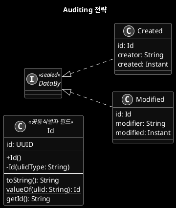
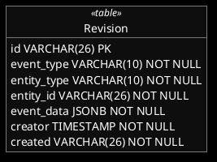
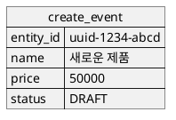
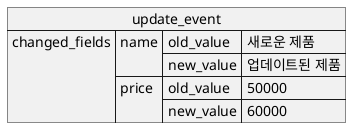
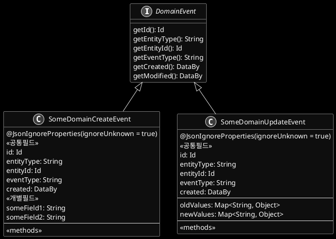

# Auditing component


- 아래 내용은 초안임

## 전략1 : Auditing 필드 

- 데이터를 생성한 사용자와 수정한 사용자의 정보를 해당 시점에 저장
- 생성자, 생성일, 수정자, 수정일



## 전략2 : revision 이력관리 

- revision은 aggregate root 를 대상으로 한다

### Table 



### JSON 구조

#### 1. create 이벤트: 모든 필드를 담아 이벤트를 발생 시킨다



#### 2. update 이벤트: 변경이 된 필드에 대하여 수정 전후 데이터를 이벤트로 발생시킨다 



## 다양한 JSON 구조를 위한 이벤트 구현 전략



## JSONB 핸들러 사용법

```xml
<insert id="insertEvent">
    INSERT INTO event_log (
        id,
        event_data
    ) VALUES (
        #{id},
        #{eventData, jdbcType=OTHER, javaType=com.yourpackage.EventData, typeHandler="com.yourpackage.TypedJsonbTypeHandler"}
    )
</insert>

<resultMap id="eventResultMap" type="com.yourpackage.EventDto">
    <id property="id" column="id"/>
    <result property="eventData" column="event_data" javaType="com.yourpackage.EventData" typeHandler="com.yourpackage.TypedJsonbTypeHandler"/>
</resultMap>

<select id="getEventById" resultMap="eventResultMap">
    SELECT
        id,
        event_data
    FROM
        event_log
    WHERE
        id = #{id}
</select>
```


